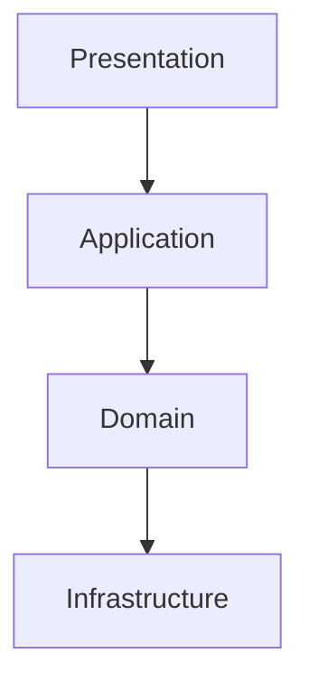

# PokeDex Manager

Aplicacion Full Stack para gestionar una coleccion personal de Pokemon.

El proyecto esta construido con Next.js App Router y sigue una arquitectura por capas para separar presentacion, casos de uso, dominio e infraestructura.

## Stack

- Next.js + React + TypeScript strict
- Tailwind CSS
- PostgreSQL + Prisma ORM
- Firebase Authentication
- Gemini (texto y vision)
- MCP Server para herramientas del dominio

## Estado actual

- Base Next.js con pnpm
- Scripts de calidad, testing y base de datos
- Prisma con schema y migracion inicial
- Docker Compose para PostgreSQL local
- Estructura inicial por capas
- Autenticacion Firebase (email/password + Google)
- Sesion server-side con cookie httpOnly
- Proteccion de rutas privadas
- Sincronizacion de usuario autenticado en PostgreSQL
- Integracion con PokeAPI para busqueda y detalle
- CRUD de coleccion por usuario con ownership
- UX polish con loading/error boundaries y estados pending en formularios
- Image Identification con Gemini Vision (procesamiento temporal, sin persistencia de imagen)
- AI Analytics con separacion entre metricas objetivas e insights IA
- AI Assistant conversacional con memoria por conversacion, herramientas MCP y confirmacion de acciones destructivas
- Busqueda de Pokemon por tipo desde assistant (ej: fuego, agua, electric)
- Recomendacion de Pokemon por tipo segun tu coleccion (ej: "de agua, cual me recomiendas")

## Requisitos

- Node.js 20+
- pnpm 10+
- Docker + Docker Compose

## Variables de entorno

1. Copiar [./.env.example](./.env.example) a un archivo local:

```bash
cp .env.example .env.local
```

2. Completar valores reales para Firebase y Gemini.
3. Para Firebase web, usar credenciales de una Web App (no solo Android).
4. Para Prisma, asegurese de tener `DATABASE_URL` disponible en el entorno que ejecuta los comandos de DB.

Nota: si no configuras FIREBASE_CLIENT_EMAIL y FIREBASE_PRIVATE_KEY, el backend valida idTokens con Identity Toolkit como fallback server-side.

Variables esperadas en `.env.local`:

- `DATABASE_URL`
- `POKE_API_BASE_URL` (opcional, default: `https://pokeapi.co/api/v2`)
- `NEXT_PUBLIC_FIREBASE_API_KEY`
- `NEXT_PUBLIC_FIREBASE_AUTH_DOMAIN`
- `NEXT_PUBLIC_FIREBASE_PROJECT_ID`
- `NEXT_PUBLIC_FIREBASE_APP_ID`
- `FIREBASE_PROJECT_ID`
- `FIREBASE_CLIENT_EMAIL`
- `FIREBASE_PRIVATE_KEY`
- `GEMINI_API_KEY`

## Setup local

1. Instalar dependencias:

```bash
pnpm install
```

2. Levantar PostgreSQL:

```bash
docker compose up -d
```

3. Generar cliente Prisma:

```bash
pnpm db:generate
```

4. Ejecutar migraciones:

```bash
pnpm db:migrate
```

5. Levantar la app:

```bash
pnpm dev
```

Aplicacion disponible en http://localhost:3000

Opcional (detener PostgreSQL local):

```bash
docker compose down
```

## Rutas principales

- /login
- /register
- /dashboard
- /pokedex
- /collection
- /identify
- /analytics
- /assistant

## Scripts

- pnpm dev
- pnpm build
- pnpm start
- pnpm lint
- pnpm typecheck
- pnpm format
- pnpm format:write
- pnpm test
- pnpm test:watch
- pnpm test:e2e
- pnpm db:generate
- pnpm db:migrate
- pnpm db:seed
- pnpm check

## Arquitectura objetivo



## Notas

- Firebase gestiona identidad.
- PostgreSQL gestiona datos de negocio.
- PokeAPI es fuente de datos oficiales de Pokemon.
- Gemini se usa para capacidades de IA.
- MCP expone herramientas del dominio para el assistant.
- Las imagenes se procesan temporalmente y no se almacenan.
- Cada usuario solo puede operar sobre sus propios items de coleccion.
- Bonus implementados: Gemini Vision, MCP y features de analisis inteligente con IA.

## Repositorio y seguridad

- Se versiona `.env.example` como plantilla sin secretos.
- Los archivos reales de entorno (`.env.local`, `.env`, etc.) quedan ignorados por git.
- `docker-compose.yml` se versiona para reproducir la base local.

## Checklist de entrega (evaluacion)

- Requerimientos base implementados: autenticacion, PokeAPI, persistencia, UI responsive.
- Bonus implementados: LMM (Gemini Vision), MCP y analitica con IA.
- Instrucciones de instalacion y ejecucion local incluidas en este README.
- Documentar en el PR/entrega cualquier limitacion conocida del entorno de desarrollo.
